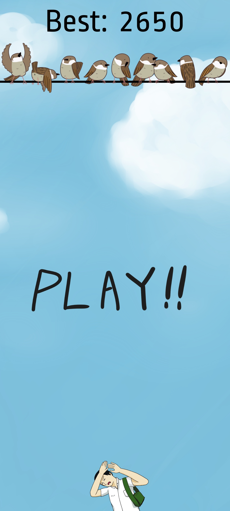
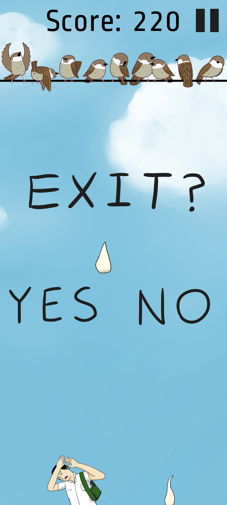
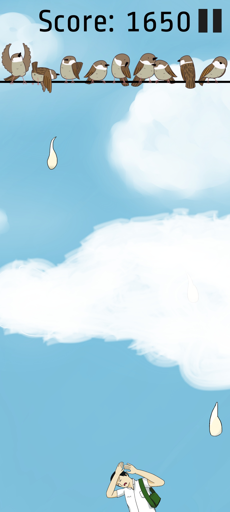

# 閃躲鳥屎

高職學校作業與同學製作的小遊戲。
### 遊玩方式
玩家要用手機的陀螺儀操控角色左右移動閃躲鳥屎以累積分數，一旦被打中遊戲就結束了。

分數每累積500就會出現雲朵遮擋玩家的視線。

### 連結
[apk 下載連結](https://drive.google.com/file/d/1Vf_IixhmpkA76s589A_JZOAco9aX2GMf/view?usp=drive_link)

### 圖片
  
